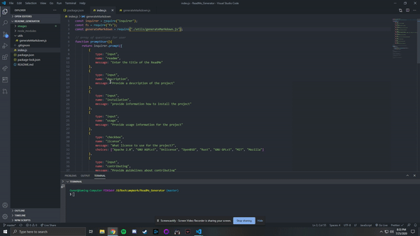
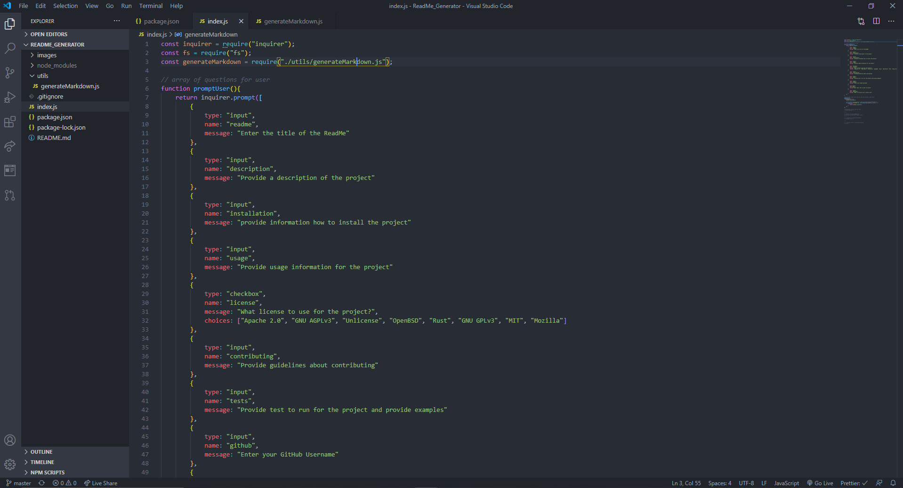
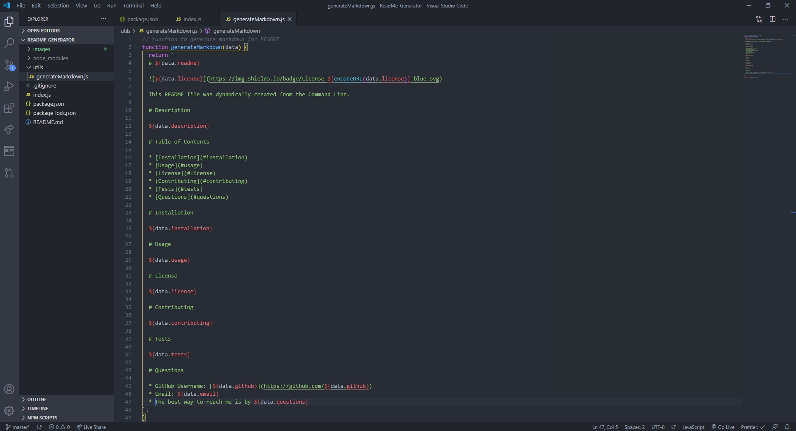
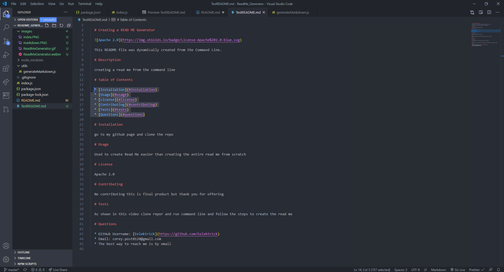

# ReadMe_Generator

# Table of Contents

* [Process](#Process)
* [Issues](#Issues)
* [Video](#Video)
* [Link](#Link)
* [Screenshot](#Screenshot)

# Process

First clone project from GitHub.

Next open the command line directly to thje file index.js.

Next type in: node index.js and press enter.

Next follow the steps and answer all questions.

After all questions have been answered the Read Me will be created.

# Issues

Only issue I ran into was remembering the terminology I used in the index.js file to match in the generate markdown

and personally aligning the question to how the information will show up on the read me.

# Video

* [Link to video demo](https://drive.google.com/file/d/1_lIxvsvU6Kf8ufg1X23uj2ZLQWV5Sb_K/view?usp=sharing)

# Link

No link needed for this project but provided a video link how to operate the command line.

# Screenshot

